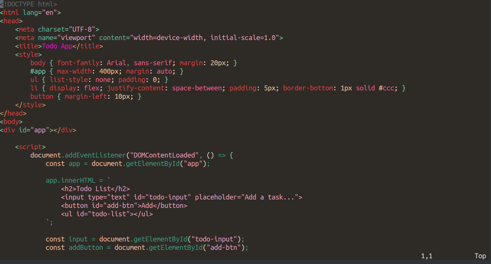
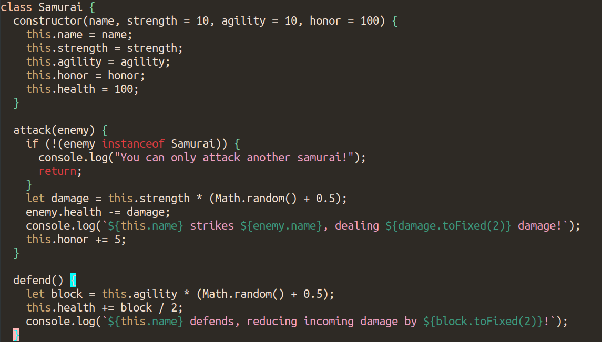

# Katana

Katana is an elegant and minimal Vim theme designed for a clean and focused coding experience.

## Installation

Create the `.vim/colors` directory if it doesn't exist:

`mkdir -p ~/.vim/colors`

Download (or copy/paste) and move the katana.vim file into the directory.

## Usage

Add the following to your `.vimrc`:

```
colorscheme katana
set termguicolors
```

## Examples


